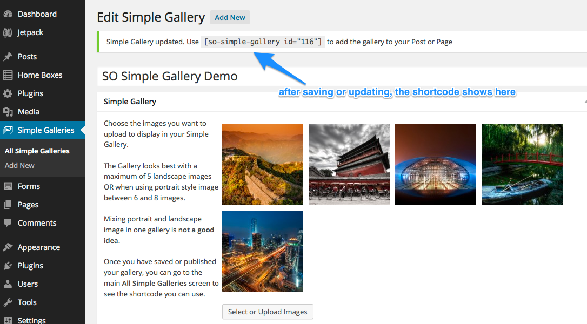
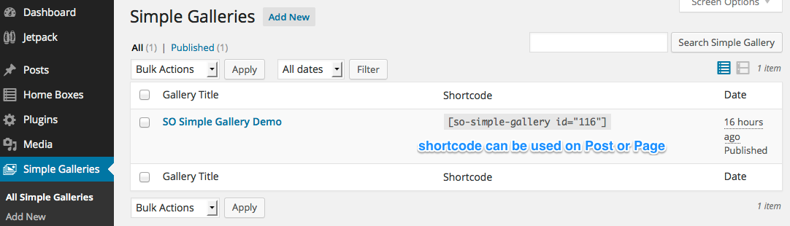

# SO Simple Gallery

###### Last updated on 2015.04.23
###### requires at least WordPress 4.0
###### tested up to WordPress 4.2
###### Author: [Piet Bos](https://github.com/senlin)
###### [Stable Version](http://wordpress.org/plugins/so-simple-gallery) (via WordPress Plugins Repository)
###### [Plugin homepage](http://so-wp.com/?p=115) with Live Demo

The SO Simple Gallery plugin gives you a mini gallery with a beautiful CSS rollover effect using a simple shortcode.

## Description

Inspired by a [LinkedIn discussion](https://www.linkedin.com/groupItem?view=&gid=154024&type=member&item=5867588708181516289) and the [Simple CSS Roll-over Image Gallery tutorial](http://demosthenes.info/blog/58/CSS-and-Images-Simple-Roll-over-Image-Gallery) by [Dudley Storey](http://github.com/dudleystorey) I decided to cook up the concept of it in a plugin.

It works with a Simple Gallery custom post type to which you can upload a maximum of 8 images using the [Meta Box plugin](http://wordpress.org/plugins/meta-box/). This is my 3rd "extension" for that plugin, which - if you have not yet installed it - will be semi-automatically added to your Plugins folder; just follow the on-screen instructions.

Once you have added images to your Simple Gallery you can add it to your Post or Page using a simple shortcode. This shortcode shows after you have published or updated the Simple Gallery. And you can also find the shortcode on the main Simple Galleries screen.

When you use the Visual Editor you will find a nice shortcode button that by clicking it adds `[so-simple-gallery id=""]` to your Post or Page content. Between the double quotes you only have to fill in the ID of the Simple Gallery you would like to add.

If you use the Text Editor instead, you can copy the shortcode from the main Simple Galleries screen and paste it into your Edit Post/Page screen.

If you would like to add a gallery to a template file, then you need to add the following code to it:

```
<?php if ( function_exists( 'sosg_shortcode' ) ) {
	echo do_shortcode( '[so-simple-gallery id="123"]' );
} ?>
```
where 123 is the ID of your Simple Gallery. 

I used a dashicon to add a button to the Visual Editor and therefore you can use the SO Simple Gallery from WordPress version 3.9 and up (as that is the version where TinyMCE 4.x was rolled into Core).

## Frequently Asked Questions

### Why is the plugin showing an error message after activation?

This plugin is an Extension for the [Meta Box plugin](http://wordpress.org/plugins/meta-box/). If you don't have that installed, this plugin will not work. If you click on the link that shows with the error message you will go to a new page "Required Plugin" to install the Meta Box plugin.

### I have an issue with this plugin, where can I get support?

Please open an issue here on [Github](https://github.com/senlin/so-simple-gallery/issues)

## Known Limitations

* The SO Simple Gallery looks best with a maximum of 5 landscape images OR when using portrait style image between 6 and 8 images.<br />Mixing portrait and landscape image in one gallery is <strong>not a good idea</strong>.

* If you are uploading images with different sizes then it is best to put the shortest images as the top image.<br />The reason for that is that the first image always shows (to create the placeholder image), so even when you hover over the other images, that first image is still there.<br />This can be solved with some javascript, but I first want to see if there are enough people that like this plugin, before I develop it further.

* I have not yet included any Options to change things like size, background color, text color, add titles and what not.<br />Again I would like to wait and see if there are enough people that like this plugin, before I develop it further.

* Depending on what theme you use, adding a SO Simple Gallery to a full-width template does not always look great.

## Contributions

This repo is open to _any_ kind of contributions.

## License

* License: GNU Version 2 or Any Later Version
* License URI: http://www.gnu.org/licenses/gpl-2.0.html

## Donations

* Donate link: http://so-wp.com/donations

## Connect with me through

[Github](https://github.com/senlin) 

[WordPress](http://profiles.wordpress.org/senlin/) 

[Website](http://senlinonline.com)

## Changelog

### 2015.04.23

* update TGM Plugin Activation class to 2.4.1 which fixes reported [XSS vulnerability](http://wptavern.com/xss-vulnerability-what-to-do-if-you-buy-or-sell-items-on-themeforest-and-codecanyon) 

### 2015.04.09

* changed logos
* new banner image for WP.org Repo by [Kyle Szegedi](https://unsplash.com/kyleszegedi)

### 2014.07.30

* added the check for the metabox plugin (all files were there, but had forgotten to build the check for it in)
* get rid of ob_end_flush() error that sometimes occurs
* tested up to WP 4.0-beta-2

### 2014.05.08

* polishing
* add documentation
* add FAQs
* add language file
* add screenshots

### 2014.05.04

* initial release

## Screenshots


---

---


